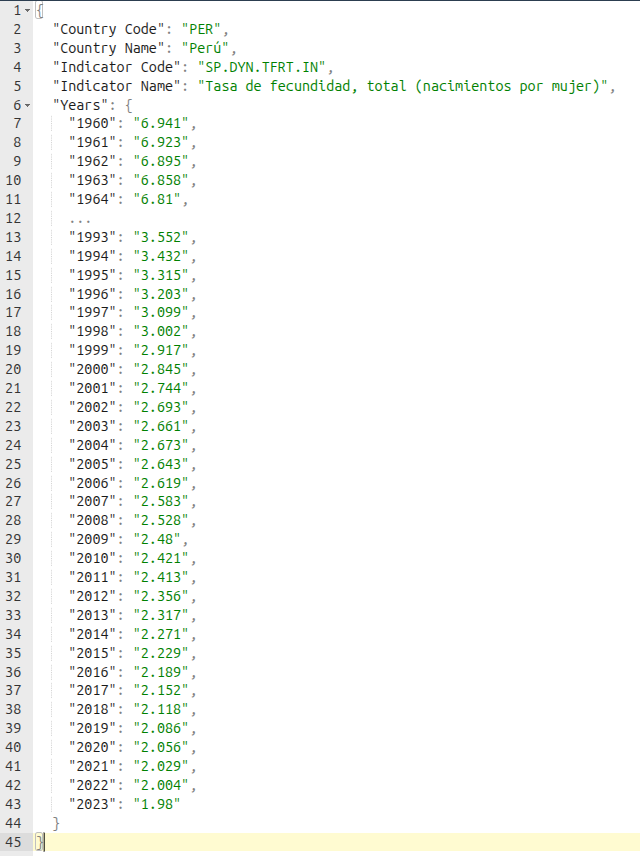

# Tasa de Fecundidad Mundial API

### Endpoints

```
/get/{country}: accede a la información del país correspondiente. Con 'all' puede obtener todos los registros.

/list: lista los paises disponibles en la API.
```

### Ejemplo de respuesta

##### - Get endpoint:



##### - List endpoint:
